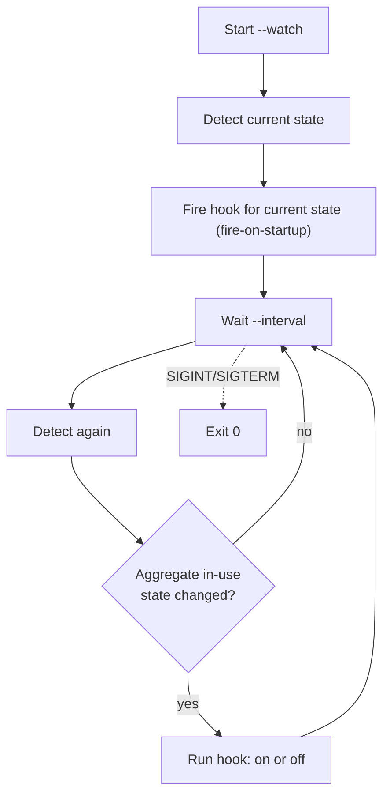

# gocamdet

Detect whether a USB camera is currently in use on a Linux system, and see
which process is using it. Pure Go, no cgo, no libusb, no external tools.

Disclaimer: This works for me — that's the entire guarantee. Built with AI in the loop, so check your own biases before you love it or hate it on principle. Use at your own risk, fork freely, and don't @ me when it explodes. (But do drop me a note if it helps — pay it forward.)

---

## Table of contents

- [What it does](#what-it-does)
- [Why](#why)
- [How it works](#how-it-works)
- [Data model](#data-model)
- [Prerequisites](#prerequisites)
- [Install](#install)
- [CLI usage](#cli-usage)
  - [Human-readable table](#human-readable-table)
  - [JSON output](#json-output)
  - [Exit codes](#exit-codes)
  - [Scripting examples](#scripting-examples)
  - [Permissions](#permissions)
- [Watch mode](#watch-mode)
  - [Flags](#flags)
  - [Transition semantics](#transition-semantics)
  - [Hook contract](#hook-contract)
- [Install as a boot service](#install-as-a-boot-service)
- [Library usage](#library-usage)
  - [API reference](#api-reference)
- [Scope and non-goals](#scope-and-non-goals)
- [Troubleshooting](#troubleshooting)
- [Project structure](#project-structure)
- [Development](#development)
- [License](#license)

---

## What it does

gocamdet reads the Linux kernel's own interfaces to answer *"is my webcam on,
and who turned it on?"*:

- Enumerates video devices from `/sys/class/video4linux`.
- Keeps only cameras whose sysfs path traces to a **USB** bus.
- Groups the multiple `/dev/videoN` nodes a single physical camera exposes
  (capture + metadata) into one logical entry per physical device.
- Marks a camera **in use** when any process holds one of its nodes open,
  found by scanning `/proc/*/fd`, and reports the owning process(es).

It ships three things:

1. A **Go library** (`github.com/gherlein/gocamdet`) exposing a single
   `Detect()` call.
2. A **CLI** (`cmd/gocamdet`) with human-readable and JSON output and
   scriptable exit codes.
3. A **watch mode** plus an example **systemd unit** that fires a hook script
   whenever a camera turns on or off — the basis for a tally light, a webhook,
   an audio mute, etc.

Linux only. See [`VISION.md`](VISION.md) for the full scope statement.

## Why

On Linux there is no single, obvious answer to "is my webcam on right now, and
who turned it on?" The information exists in the kernel — video devices under
`/sys/class/video4linux`, USB topology under `/sys/bus/usb`, and open file
handles under `/proc/*/fd` — but stitching it together requires knowledge of
V4L2, sysfs, and procfs semantics. gocamdet packages that knowledge behind a
small, well-defined API and a scriptable CLI, with no external dependencies.

## How it works

Detection is a pure read of kernel-exported filesystems — no device is opened,
no frame is captured, nothing is written.

```mermaid
flowchart TD
    A[/sys/class/video4linux] -->|list videoN nodes| B[Resolve each class symlink<br/>to its device directory]
    B --> C{Ancestry includes a<br/>USB device descriptor?<br/>idVendor + idProduct}
    C -- no --> X[Exclude:<br/>built-in/MIPI, PCI, virtual]
    C -- yes --> D[Record node + USB identity<br/>name, vendorId, productId, serial]
    D --> E[Group nodes by physical<br/>USB device path]
    E --> F[/proc/*/fd — scan open handles/]
    F --> G[Match open /dev/videoN handles<br/>to their owning camera]
    G --> H[Result: cameras, in-use flags,<br/>owning processes, visibility]
```

Step by step:

1. **Enumerate** — read `/sys/class/video4linux`, resolve each `videoN` class
   symlink to its device directory.
2. **USB filter** — keep a node only if its ancestry includes a USB device
   descriptor (a directory containing `idVendor` and `idProduct`). That
   directory is the physical-device key. Non-USB cameras (built-in/MIPI, PCI)
   and virtual devices (v4l2loopback, OBS) are excluded by scope.
3. **Group** — modern UVC cameras expose several `/dev/videoN` nodes per
   physical camera (capture + metadata). All nodes sharing a USB device path
   collapse into one `Camera` entry.
4. **Attribute** — scan `/proc/*/fd` for open handles pointing at any camera
   node. A camera is **in use** if any of its nodes is open; each open handle
   is attributed to the owning process (`pid`, `comm`, and which node).
5. **Report** — return a deterministic, sorted snapshot (cameras by USB path,
   users by pid) along with a `fullVisibility` flag.

Node liveness is handled gracefully: a device unplugged mid-scan is tolerated
rather than treated as an error. The *absence* of the V4L2 class itself is
treated as an environment precondition violation and returns an error.

## Data model

A detection snapshot is a `Result`:

| Type | Field | Description |
| --- | --- | --- |
| `Result` | `cameras` | list of physical USB cameras |
| | `fullVisibility` | `false` if some `/proc` entries were unreadable (not root) — `users` lists may be incomplete |
| `Camera` | `name` | model name from sysfs, e.g. `HD Pro Webcam C920` |
| | `usbPath` | physical-device key, e.g. `/sys/bus/usb/devices/1-2` |
| | `vendorId` | 4-hex USB vendor id, e.g. `046d` |
| | `productId` | 4-hex USB product id, e.g. `082d` |
| | `serial` | may be empty if not exposed |
| | `nodes` | the `/dev/videoN` nodes, e.g. `["/dev/video0","/dev/video1"]` |
| | `inUse` | `true` if any node is held open |
| | `users` | processes holding a node open (may be partial without root) |
| `Process` | `pid` | process id |
| | `name` | from `/proc/<pid>/comm` |
| | `node` | which `/dev/videoN` this process has open |

## Prerequisites

- **Runtime:** Linux with V4L2 (`/sys/class/video4linux`) and procfs (`/proc`)
  — any modern distribution. No other runtime dependencies: no cgo, no libusb,
  no external tools.
- **Build:** Go 1.26 or newer and `make`.
- **Root** (or `sudo`) only for complete process attribution across all users;
  see [Permissions](#permissions).

## Install

With the Go toolchain:

```sh
go install github.com/gherlein/gocamdet/cmd/gocamdet@latest
```

Or build from source:

```sh
make build      # produces ./bin/gocamdet
```

See [Install as a boot service](#install-as-a-boot-service) for the
watch-at-boot deployment.

## CLI usage

```sh
gocamdet          # human-readable table
gocamdet --json   # machine-readable JSON on stdout
```

### Human-readable table

```
$ gocamdet
CAMERA              VENDOR:PRODUCT  NODES                   IN USE  USED BY
HD Pro Webcam C920  046d:082d       /dev/video0,/dev/video1  yes     zoom(1234)
```

When no USB cameras are present it prints `No USB cameras found.` A missing
value (e.g. an unnamed camera, or no users) renders as `-`.

### JSON output

`--json` writes an indented object to stdout matching the [data
model](#data-model):

```json
{
  "cameras": [
    {
      "name": "HD Pro Webcam C920",
      "usbPath": "/sys/bus/usb/devices/1-2",
      "vendorId": "046d",
      "productId": "082d",
      "serial": "",
      "nodes": ["/dev/video0", "/dev/video1"],
      "inUse": true,
      "users": [
        { "pid": 1234, "name": "zoom", "node": "/dev/video0" }
      ]
    }
  ],
  "fullVisibility": true
}
```

The reduced-visibility note is written to **stderr**, so JSON on stdout stays
clean for piping into `jq`.

### Exit codes

Both the one-shot CLI and a clean watch-mode shutdown use these:

| Code | Meaning |
| --- | --- |
| `0` | No USB camera in use |
| `1` | At least one USB camera in use |
| `2` | Error (e.g. V4L2 class absent) |

### Scripting examples

Gate an action on whether the camera is free:

```sh
if gocamdet >/dev/null; then
  echo "camera is free"
else
  echo "camera is in use"
fi
```

List the processes using any camera with `jq`:

```sh
gocamdet --json | jq -r '.cameras[] | select(.inUse) | .users[] | "\(.name) (\(.pid))"'
```

### Permissions

Reading another user's `/proc/<pid>/fd` requires root. Without it, gocamdet
still reports every camera and detects handles held by **your own** processes,
but it prints a note to stderr and sets `fullVisibility: false` in JSON. Run
with `sudo` for complete process attribution across all users:

```sh
sudo gocamdet
```

Enumeration and in-use detection do **not** require root — only full
cross-user process attribution does.

## Watch mode

Run continuously and fire a hook script when a camera turns on or off. The
transition is *aggregate*: `on` fires when the system goes from *no* camera in
use to *any* camera in use, and `off` when it returns to none.

```sh
gocamdet --watch --interval 2s --script /etc/gocamdet/hook.sh
```



### Flags

| Flag | Default | Meaning |
| --- | --- | --- |
| `--watch` | off | Run continuously instead of one-shot |
| `--interval` | `2s` | Poll period (Go duration, e.g. `500ms`, `5s`) |
| `--script` | none | Hook script run on each transition; omit to only log |
| `--script-timeout` | `30s` | Max run time for the hook before it is killed |
| `--json` | off | Emit one JSON object per transition instead of a log line |

### Transition semantics

- **Fire-on-startup:** at launch the current state is emitted immediately (so
  booting with a camera already on fires `on`), then the hook fires only on
  changes.
- **Aggregate only:** the hook fires on the *any-camera* boundary, not per
  device. Going from one camera in use to two does not re-fire `on`.
- **Console log:** each transition prints a one-line human record to stdout
  (or one JSON object with `--json`).
- **Resilience:** a slow or failing hook is logged to stderr but never stops
  the watcher. The hook runs in its own process group and, on timeout, the
  whole group is killed with `SIGKILL` — so a child the hook spawns (e.g.
  `sleep`) cannot wedge the loop.
- **Shutdown:** `SIGINT`/`SIGTERM` shut it down cleanly (exit `0`). A fatal
  detection error exits `2`.

### Hook contract

The hook is invoked synchronously as `hook.sh on` or `hook.sh off`, with
details passed via environment variables:

| Variable | Example | Notes |
| --- | --- | --- |
| `CAMDET_EVENT` | `on` / `off` | same as `$1` |
| `CAMDET_TIMESTAMP` | `2026-09-10T14:46:38-07:00` | RFC3339 |
| `CAMDET_CAMERAS_IN_USE` | `1` | count of in-use cameras |
| `CAMDET_CAMERA_NAMES` | `HD Pro Webcam C920` | comma-separated |
| `CAMDET_CAMERA_IDS` | `046d:082d` | comma-separated `vendor:product` |
| `CAMDET_USERS` | `zoom(1234)` | comma-separated `name(pid)` |

The per-camera lists cover only in-use cameras, so they are **empty for an
`off` event**. See [`systemd/hook.sh.example`](systemd/hook.sh.example) for a
starting point:

```sh
#!/bin/sh
case "$1" in
  on)  logger -t gocamdet "camera ON at ${CAMDET_TIMESTAMP}: ${CAMDET_CAMERA_NAMES} used by ${CAMDET_USERS}" ;;
  off) logger -t gocamdet "camera OFF at ${CAMDET_TIMESTAMP}" ;;
  *)   logger -t gocamdet "unknown event: $1"; exit 1 ;;
esac
```

## Install as a boot service

An example system-level systemd unit runs watch mode at boot as root (so
process attribution is complete):

```sh
make build             # build as your user; install targets never invoke go
sudo make install      # binary -> /usr/local/bin, unit -> /etc/systemd/system,
                       # hook -> /etc/gocamdet/hook.sh (edit this for your action)
sudo systemctl daemon-reload
sudo systemctl enable --now gocamdet
journalctl -u gocamdet -f
```

Build and install are separate steps **on purpose**: `go` lives in your user's
`PATH`, not root's, so you build as yourself and only the file-copying install
runs under `sudo`. If you maintain your own unit file, use `sudo make
install-bin` to install just the binary and leave your unit untouched.

The shipped unit runs:

```
ExecStart=/usr/local/bin/gocamdet --watch --interval 2s --script /etc/gocamdet/hook.sh
```

as root under `Restart=on-failure`, hardened with `ProtectSystem=strict` and
`ProtectHome=true` (it reads only sysfs/procfs and executes the configured
hook). Edit `/etc/gocamdet/hook.sh` to do whatever you need on transitions
(drive a tally light over GPIO, post a webhook, mute audio). Remove everything
with `sudo make uninstall` (which leaves `/etc/gocamdet` in place in case it
holds your customized hook).

## Library usage

```go
package main

import (
	"fmt"

	"github.com/gherlein/gocamdet"
)

func main() {
	result, err := camdet.Detect()
	if err != nil {
		panic(err)
	}
	for _, cam := range result.Cameras {
		fmt.Printf("%s (%s:%s) in use: %t\n", cam.Name, cam.VendorID, cam.ProductID, cam.InUse)
		for _, u := range cam.Users {
			fmt.Printf("  used by %s (pid %d) via %s\n", u.Name, u.PID, u.Node)
		}
	}
	if !result.FullVisibility {
		fmt.Println("note: run as root for complete process attribution")
	}
}
```

### API reference

The package name is `camdet` (import path `github.com/gherlein/gocamdet`).

```go
// Detect scans the live system and returns the current snapshot of USB cameras.
func Detect() (*Result, error)

type Result struct {
	Cameras        []Camera
	FullVisibility bool // false if some /proc entries were unreadable (not root)
}

type Camera struct {
	Name      string
	USBPath   string
	VendorID  string
	ProductID string
	Serial    string
	Nodes     []string
	InUse     bool
	Users     []Process
}

type Process struct {
	PID  int
	Name string
	Node string
}
```

`Detect()` returns an error only on an environment precondition violation
(e.g. the V4L2 class directory is absent). Devices unplugged mid-scan are
tolerated silently.

## Scope and non-goals

Explicitly **in scope** (see [`VISION.md`](VISION.md) for the authoritative
statement):

- Linux only — detection relies on V4L2, sysfs, and procfs. The public API is
  kept backend-agnostic so other platforms could be added later.
- **USB cameras only** — a `/dev/videoN` node is included only when its sysfs
  path traces to a USB bus.

Explicit **non-goals**:

- **Not** built-in/MIPI, PCI, or virtual cameras (v4l2loopback, OBS) — these
  are excluded.
- **"In use" means "held open."** A camera is in use when a process holds one
  of its nodes open (found via `/proc/*/fd`). gocamdet does **not** try to
  distinguish "open" from "actively streaming" — that is unreliable on Linux
  while another process owns the device.
- No microphone/audio detection. (See
  [`docs/howto-dothis-microphone.md`](docs/howto-dothis-microphone.md) for
  notes on the analogous approach.)

## Troubleshooting

| Symptom | Cause / fix |
| --- | --- |
| `reduced visibility` on stderr, empty `users` | Not running as root; re-run with `sudo` for cross-user attribution. |
| Camera missing from output | It is not USB (built-in/MIPI/PCI) or is virtual — out of scope. |
| `inUse: false` while streaming | The owning process's `/proc/<pid>/fd` was unreadable without root, or the stream holds no `/dev/videoN` open. |
| Error, exit code `2` | `/sys/class/video4linux` is absent — not a V4L2 system, or a container without the class exposed. |
| systemd hook does nothing | Confirm `--script` path exists and is executable; check `journalctl -u gocamdet` for hook stderr. |

## Project structure

```
gocamdet/
  camdet.go                 public API (types + Detect())
  sysfs.go                  enumerate video nodes, USB filter, grouping
  procscan.go               /proc/*/fd open-handle scanning
  camdet_test.go            library tests against synthetic sysfs/proc trees
  cmd/gocamdet/
    main.go                 CLI: flags, one-shot table/JSON output
    watch.go                --watch loop, transition hook, systemd entry point
    watch_test.go           watch-mode tests (injected detect, no hardware)
  systemd/
    gocamdet.service        example system unit (runs watch mode at boot)
    hook.sh.example         example transition hook
  Makefile                  build/test/install targets
  VISION.md                 scope and non-goals
  docs/                     design spec and how-to notes
```

## Development

Run `make` with no target to list everything. Common targets:

```sh
make build       # build the CLI into ./bin/gocamdet
make test        # run the test suite (alias: make run-tests)
make fmt         # format sources with gofmt
make vet         # go vet
make lint        # golangci-lint if installed
make install-bin # install only the binary (needs root; build first)
make install     # install binary, systemd unit, and example hook (needs root)
make uninstall   # remove the installed binary and unit (needs root)
make clean       # remove build artifacts
```

Always build and test through `make`, not `go build`/`go test` directly.

Both the library scan and the watch loop are built for testing without
hardware or root. The scan is parameterized by a filesystem root, so the
detection pipeline runs against synthetic sysfs/proc trees. The watch loop
takes an injected detection function and a caller-driven tick channel, so
transitions are exercised deterministically with no real cameras and no
sleeping.

## License

See the repository for license terms.
