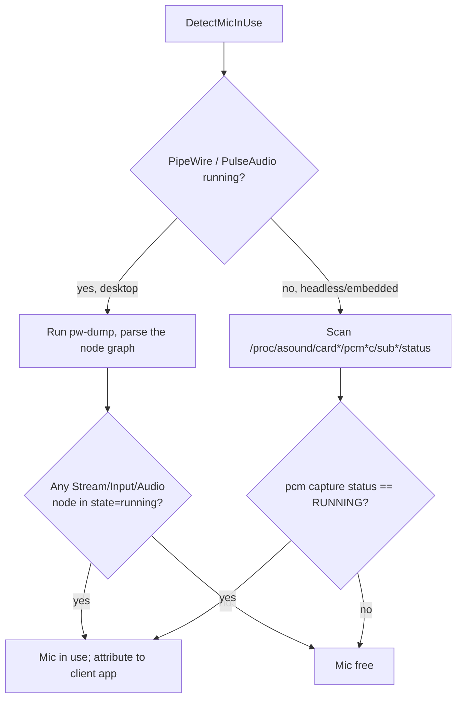
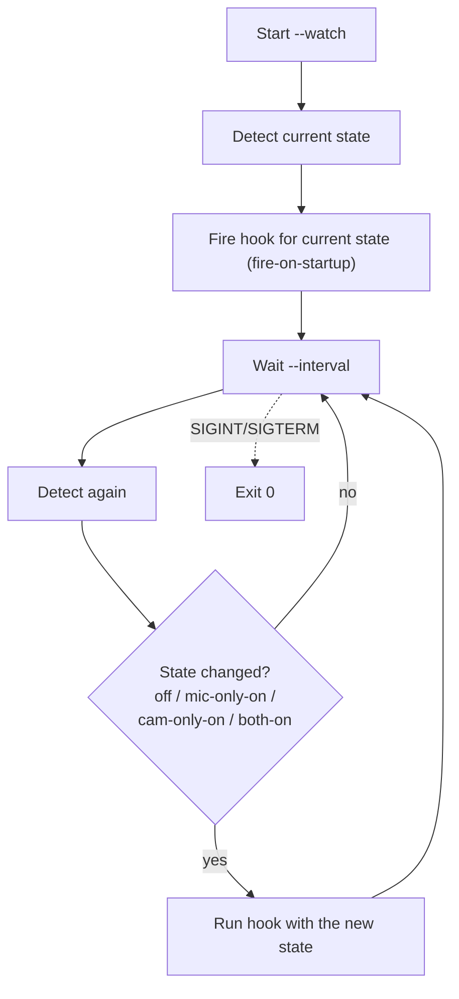

# gocamdet

Detect whether a USB camera or a microphone is currently in use on a Linux
system, tell *open* apart from *actively streaming*, and see which process is
using each device. Pure Go for the camera path; the microphone path uses the
system's sound server. No cgo, no libusb.

Disclaimer: This works for me — that's the entire guarantee. Built with AI in the loop, so check your own biases before you love it or hate it on principle. Use at your own risk, fork freely, and don't @ me when it explodes. (But do drop me a note if it helps — pay it forward.)

---

## Table of contents

- [What it does](#what-it-does)
- [Why](#why)
- [How it works](#how-it-works)
  - [Camera detection](#camera-detection)
  - [Microphone detection](#microphone-detection)
- [Data model](#data-model)
- [Prerequisites](#prerequisites)
- [Install](#install)
- [CLI usage](#cli-usage)
  - [Human-readable table](#human-readable-table)
  - [JSON output](#json-output)
  - [Exit codes](#exit-codes)
  - [Scripting examples](#scripting-examples)
  - [Permissions](#permissions)
- [Watch mode](#watch-mode)
  - [Flags](#flags)
  - [Transition semantics](#transition-semantics)
  - [Hook contract](#hook-contract)
- [Install as a boot service](#install-as-a-boot-service)
- [Library usage](#library-usage)
  - [API reference](#api-reference)
- [Scope and non-goals](#scope-and-non-goals)
- [Troubleshooting](#troubleshooting)
- [Project structure](#project-structure)
- [Development](#development)
- [License](#license)

---

## What it does

gocamdet reads the Linux kernel's own interfaces (and, for audio, the sound
server) to answer *"is my webcam or mic on, and who turned it on?"*:

- Enumerates video devices from `/sys/class/video4linux`.
- Keeps only cameras whose sysfs path traces to a **USB** bus.
- Groups the multiple `/dev/videoN` nodes a single physical camera exposes
  (capture + metadata) into one logical entry per physical device.
- Reports two distinct states per camera: **open** (a process holds one of its
  nodes open, found by scanning `/proc/*/fd`, with the owning process(es)) and
  **streaming** (the USB VideoStreaming interface is actively capturing). An app
  probing device capabilities shows *open* but not *streaming*.
- Detects microphones actively capturing audio, via **PipeWire** on desktops
  (covering USB, built-in, and Bluetooth mics) and raw **ALSA** on headless
  systems, and attributes each to the capturing process.

It ships three things:

1. A **Go library** (`github.com/gherlein/gocamdet`, package `camdet`) exposing
   `Detect()` for cameras and `DetectWithMic()` for cameras plus microphones.
2. A **CLI** (`cmd/gocamdet`) with human-readable and JSON output and
   scriptable exit codes.
3. A **watch mode** plus an example **systemd unit** that fires a hook script
   whenever the camera/mic state changes — the basis for a tally light, a
   webhook, an "in a meeting" indicator, etc.

Linux only. See [`VISION.md`](VISION.md) for the full scope statement.

## Why

On Linux there is no single, obvious answer to "is my webcam or mic on right
now, and who turned it on?" The information exists — video devices under
`/sys/class/video4linux`, USB topology under `/sys/bus/usb`, open file handles
under `/proc/*/fd`, and the audio graph inside PipeWire or ALSA — but stitching
it together requires knowledge of V4L2, sysfs, procfs, and sound-server
semantics. gocamdet packages that knowledge behind a small, well-defined API
and a scriptable CLI.

The camera path has zero external dependencies. The microphone path uses the
sound server that is already running on the host (see
[Prerequisites](#prerequisites)).

## How it works

### Camera detection

Camera detection is a pure read of kernel-exported filesystems — no device is
opened, no frame is captured, nothing is written.

```mermaid
flowchart TD
    A[/sys/class/video4linux] -->|list videoN nodes| B[Resolve each class symlink<br/>to its device directory]
    B --> C{Ancestry includes a<br/>USB device descriptor?<br/>idVendor + idProduct}
    C -- no --> X[Exclude:<br/>built-in/MIPI, PCI, virtual]
    C -- yes --> D[Record node + USB identity<br/>name, vendorId, productId, serial]
    D --> E[Group nodes by physical<br/>USB device path]
    E --> F[/proc/*/fd — scan open handles/]
    F --> G[Match open /dev/videoN handles<br/>to their owning camera → open + users]
    E --> S[Read USB VideoStreaming<br/>alternate setting → streaming]
    G --> H[Result: cameras, open flags,<br/>streaming flags, owning processes, visibility]
    S --> H
```

Step by step:

1. **Enumerate** — read `/sys/class/video4linux`, resolve each `videoN` class
   symlink to its device directory.
2. **USB filter** — keep a node only if its ancestry includes a USB device
   descriptor (a directory containing `idVendor` and `idProduct`). That
   directory is the physical-device key. Non-USB cameras (built-in/MIPI, PCI)
   and virtual devices (v4l2loopback, OBS) are excluded by scope.
3. **Group** — modern UVC cameras expose several `/dev/videoN` nodes per
   physical camera (capture + metadata). All nodes sharing a USB device path
   collapse into one `Camera` entry.
4. **Open detection** — scan `/proc/*/fd` for open handles pointing at any
   camera node. A camera is **open** (`InUse`) if any of its nodes is held open;
   each open handle is attributed to the owning process (`pid`, `comm`, node).
5. **Streaming detection** — read the camera's USB VideoStreaming interface. A
   UVC camera selects a non-zero alternate setting to allocate isochronous
   bandwidth *only while streaming*; merely opening the device or reading its
   controls leaves it at alternate setting 0. This transport-level signal is
   independent of how a client maps buffers (mmap, DMABUF, userptr, `read()`),
   so it detects capture through PipeWire and the xdg camera portal as well as
   direct V4L2 clients. Cameras that stream over bulk endpoints expose a single
   alternate setting and never change it; for those `streaming` reports `false`
   and callers fall back to the `open` state.
6. **Report** — return a deterministic, sorted snapshot (cameras by USB path,
   users by pid) along with a `fullVisibility` flag.

Node liveness is handled gracefully: a device unplugged mid-scan is tolerated
rather than treated as an error. The *absence* of the V4L2 class itself is
treated as an environment precondition violation and returns an error.

### Microphone detection

Applications on a desktop do not open `/dev/snd/*` directly — the sound server
(PipeWire/PulseAudio) owns the hardware and apps stream through it, and a
Bluetooth headset never appears under ALSA at all. So gocamdet queries the sound
server where one is running and falls back to raw ALSA where none is.



- **PipeWire path** (desktop): runs `pw-dump`, keeps nodes in `state=running`,
  and reports each `Audio/Source` (a hardware/Bluetooth capture device) and each
  `Stream/Input/Audio` (an application capturing), attributing the latter to its
  `application.process.id` / `application.process.binary`. This path sees USB,
  built-in, and Bluetooth (`bluez5`) mics alike.
- **ALSA path** (headless/embedded): reads
  `/proc/asound/card*/pcm*c/sub*/status`, treating `state: RUNNING` as in-use
  and reading `owner_pid` for attribution (root-free).

See [`docs/howto-dothis-microphone.md`](docs/howto-dothis-microphone.md) for the
full rationale, the Bluetooth profile details, and the "in a meeting" (camera
AND mic) correlation approach.

## Data model

The camera-only snapshot is a `Result`; the combined snapshot returned by
`DetectWithMic()` is a `MicResult` (a `Result` plus `mics`).

| Type | Field | Description |
| --- | --- | --- |
| `MicResult` | `cameras` | list of physical USB cameras (promoted from `Result`) |
| | `fullVisibility` | `false` if some `/proc` entries were unreadable (not root) — camera `users` lists may be incomplete |
| | `mics` | list of microphones detected as in use |
| `Camera` | `name` | model name from sysfs, e.g. `HD Pro Webcam C920` |
| | `usbPath` | physical-device key, e.g. `/sys/bus/usb/devices/1-2` |
| | `vendorId` | 4-hex USB vendor id, e.g. `046d` |
| | `productId` | 4-hex USB product id, e.g. `082d` |
| | `serial` | may be empty if not exposed |
| | `nodes` | the `/dev/videoN` nodes, e.g. `["/dev/video0","/dev/video1"]` |
| | `inUse` | `true` if any node is held open (open, **not** necessarily streaming) |
| | `streaming` | `true` if the USB VideoStreaming interface is actively capturing |
| | `users` | processes holding a node open (may be partial without root) |
| `Process` | `pid` | process id (camera holder) |
| | `name` | from `/proc/<pid>/comm` |
| | `node` | which `/dev/videoN` this process has open |
| `Mic` | `name` | device name from PipeWire/ALSA |
| | `device` | device identifier (PipeWire node name, or ALSA subdevice status path) |
| | `inUse` | `true` if the device is actively capturing |
| | `backend` | `pipewire` or `alsa` |
| | `users` | processes capturing audio (may be partial) |
| `User` | `pid` | process id (mic capturer) |
| | `name` | from `/proc/<pid>/comm` (PipeWire: `application.process.binary`) |

Camera holders are `Process` (which node they hold); mic capturers are `User`
(no node concept). A `Mic` has only an in-use state — the open-vs-streaming
distinction is a camera property.

## Prerequisites

- **Runtime, camera detection:** Linux with V4L2 (`/sys/class/video4linux`) and
  procfs (`/proc`) — any modern distribution. No external dependencies: no cgo,
  no libusb, no external tools.
- **Runtime, microphone detection:**
  - *Desktop:* PipeWire (or PulseAudio) running, and the `pw-dump` command on
    `PATH` (ships with PipeWire). gocamdet shells out to it. Runs in the user's
    session — no root needed for the audio graph itself.
  - *Headless/embedded:* nothing extra — the ALSA fallback reads `/proc/asound`.
  - If mic detection fails, it degrades to an empty mic list rather than failing
    the whole scan.
- **Build:** Go 1.26 or newer and `make`.
- **Root** (or `sudo`) only for complete *process* attribution across all users;
  see [Permissions](#permissions).

## Install

With the Go toolchain:

```sh
go install github.com/gherlein/gocamdet/cmd/gocamdet@latest
```

Or build from source:

```sh
make build      # produces ./bin/gocamdet
```

See [Install as a boot service](#install-as-a-boot-service) for the
watch-at-boot deployment.

## CLI usage

```sh
gocamdet          # human-readable table (cameras and microphones)
gocamdet --json   # machine-readable JSON on stdout
```

### Human-readable table

```
$ gocamdet
DEVICE              TYPE    NODES                    OPEN  STREAMING  USED BY
HD Pro Webcam C920  camera  /dev/video0,/dev/video1  yes   yes        zoom(1234)
HD Pro Webcam C920  mic     alsa_input.usb-046d_...  yes   -          zoom(1234)
```

Columns: `OPEN` is whether a process holds the device (for a camera, a node is
held open; for a mic, it is capturing). `STREAMING` applies only to cameras — a
mic renders `-` because its in-use state already means active capture. For a
camera being probed you see `OPEN=yes, STREAMING=no`. When nothing is present it
prints `No USB cameras or microphones found.` A missing value renders as `-`.

### JSON output

`--json` writes an indented object to stdout matching the [data
model](#data-model):

```json
{
  "cameras": [
    {
      "name": "HD Pro Webcam C920",
      "usbPath": "/sys/bus/usb/devices/1-2",
      "vendorId": "046d",
      "productId": "082d",
      "serial": "",
      "nodes": ["/dev/video0", "/dev/video1"],
      "inUse": true,
      "streaming": true,
      "users": [
        { "pid": 1234, "name": "zoom", "node": "/dev/video0" }
      ]
    }
  ],
  "fullVisibility": true,
  "mics": [
    {
      "name": "alsa_input.usb-046d_HD_Pro_Webcam_C920",
      "device": "alsa_input.usb-046d_HD_Pro_Webcam_C920",
      "inUse": true,
      "users": [ { "pid": 1234, "name": "zoom" } ],
      "backend": "pipewire"
    }
  ]
}
```

The reduced-visibility note is written to **stderr**, so JSON on stdout stays
clean for piping into `jq`.

### Exit codes

Both the one-shot CLI and a clean watch-mode shutdown use these. Note the
one-shot exit code is driven by **streaming** (cameras) and **in-use** (mics),
not by a camera merely being open:

| Code | Meaning |
| --- | --- |
| `0` | No camera streaming and no mic in use |
| `1` | At least one camera is actively streaming, or a mic is in use |
| `2` | Error (e.g. V4L2 class absent) |

A camera that is only open (e.g. an app probing capabilities) does **not** set
exit code `1`.

### Scripting examples

Gate an action on whether a camera is actively streaming or a mic is capturing:

```sh
if gocamdet >/dev/null; then
  echo "camera/mic is free"
else
  echo "camera is streaming or mic is in use"
fi
```

List the processes actively streaming a camera with `jq`:

```sh
gocamdet --json | jq -r '.cameras[] | select(.streaming) | .users[] | "\(.name) (\(.pid))"'
```

List the processes capturing audio:

```sh
gocamdet --json | jq -r '.mics[] | select(.inUse) | .users[] | "\(.name) (\(.pid))"'
```

### Permissions

Reading another user's `/proc/<pid>/fd` requires root. Without it, gocamdet
still reports every camera and its open/streaming state, still detects handles
held by **your own** processes, but prints a note to stderr and sets
`fullVisibility: false` in JSON. Run with `sudo` for complete process
attribution across all users:

```sh
sudo gocamdet
```

Enumeration, streaming detection, and mic in-use detection do **not** require
root — only full cross-user *process* attribution does. (The PipeWire mic path
needs access to the user's session, so run it as the desktop user, not root.)

## Watch mode

Run continuously and fire a hook script whenever the camera/mic state changes.
State is tracked as four values and the hook fires on **every** change between
them:

| State | Meaning |
| --- | --- |
| `off` | no camera streaming and no mic in use |
| `mic-only-on` | a mic is in use, no camera streaming |
| `cam-only-on` | a camera is streaming, no mic in use |
| `both-on` | a camera is streaming and a mic is in use |

```sh
gocamdet --watch --interval 2s --script /etc/gocamdet/hook.sh
```



### Flags

| Flag | Default | Meaning |
| --- | --- | --- |
| `--watch` | off | Run continuously instead of one-shot |
| `--interval` | `2s` | Poll period (Go duration, e.g. `500ms`, `5s`) |
| `--script` | none | Hook script run on each transition; omit to only log |
| `--script-timeout` | `30s` | Max run time for the hook before it is killed |
| `--json` | off | Emit one JSON object per transition instead of a log line |

### Transition semantics

- **Streaming, not merely open:** a camera counts toward the state only when it
  is *streaming*, so an app that probes the device (opens it without capturing)
  does not fire the hook.
- **Fire-on-startup:** at launch the current state is emitted immediately (so
  booting with a camera already streaming fires `cam-only-on`), then the hook
  fires only on changes.
- **Every state change fires**, including transitions between "on" sub-states
  (e.g. `mic-only-on` → `both-on` when the camera starts after the mic). This is
  deliberate: the hook typically drives a status light that must reflect the
  current devices at all times, so it must not be stranded on a stale state.
  The transition granularity is the four states above, not per device — going
  from one streaming camera to two does not re-fire `cam-only-on`.
- **Console log:** each transition prints a one-line human record to stdout
  (or one JSON object with `--json`).
- **Resilience:** a slow or failing hook is logged to stderr but never stops
  the watcher. The hook runs in its own process group and, on timeout, the
  whole group is killed with `SIGKILL` — so a child the hook spawns (e.g.
  `sleep`) cannot wedge the loop.
- **Shutdown:** `SIGINT`/`SIGTERM` shut it down cleanly (exit `0`). A fatal
  detection error exits `2`.

### Hook contract

The hook is invoked synchronously as `hook.sh <event>`, where `<event>` is one
of `mic-only-on`, `cam-only-on`, `both-on`, `off`, with details passed via
environment variables:

| Variable | Example | Notes |
| --- | --- | --- |
| `CAMDET_EVENT` | `both-on` | same as `$1` |
| `CAMDET_TIMESTAMP` | `2026-09-10T14:46:38-07:00` | RFC3339 |
| `CAMDET_CAMERAS_IN_USE` | `1` | count of streaming cameras |
| `CAMDET_CAMERA_NAMES` | `HD Pro Webcam C920` | comma-separated (streaming cameras) |
| `CAMDET_CAMERA_IDS` | `046d:082d` | comma-separated `vendor:product` |
| `CAMDET_USERS` | `zoom(1234)` | comma-separated `name(pid)`, camera holders |
| `CAMDET_MICS_IN_USE` | `1` | count of in-use mics |
| `CAMDET_MIC_NAMES` | `alsa_input.usb-046d_...` | comma-separated (in-use mics) |
| `CAMDET_MIC_USERS` | `zoom(1234)` | comma-separated `name(pid)`, mic capturers |

The per-device lists cover only the devices currently in use, so they are
**empty for an `off` event**, and the camera lists are empty for `mic-only-on`
(and vice versa). See [`systemd/hook.sh.example`](systemd/hook.sh.example) for a
starting point that drives an LED — blue for mic-only, red when the camera is on:

```sh
#!/bin/sh
case "$1" in
  mic-only-on)          logger -t gocamdet "mic ON: ${CAMDET_MIC_NAMES} used by ${CAMDET_MIC_USERS}" ;;
  cam-only-on|both-on)  logger -t gocamdet "camera ON: ${CAMDET_CAMERA_NAMES} used by ${CAMDET_USERS}" ;;
  off)                  logger -t gocamdet "device OFF at ${CAMDET_TIMESTAMP}" ;;
  *)                    logger -t gocamdet "unknown event: $1"; exit 1 ;;
esac
```

## Install as a boot service

An example system-level systemd unit runs watch mode at boot as root (so
process attribution is complete):

```sh
make build             # build as your user; install targets never invoke go
sudo make install      # binary -> /usr/local/bin, unit -> /etc/systemd/system,
                       # hook -> /etc/gocamdet/hook.sh (edit this for your action)
sudo systemctl daemon-reload
sudo systemctl enable --now gocamdet
journalctl -u gocamdet -f
```

Build and install are separate steps **on purpose**: `go` lives in your user's
`PATH`, not root's, so you build as yourself and only the file-copying install
runs under `sudo`. If you maintain your own unit file, use `sudo make
install-bin` to install just the binary and leave your unit untouched.

The shipped unit runs:

```
ExecStart=/usr/local/bin/gocamdet --watch --interval 2s --script /etc/gocamdet/hook.sh
```

as root under `Restart=on-failure`, hardened with `ProtectSystem=strict` and
`ProtectHome=true` (it reads only sysfs/procfs and executes the configured hook
under `/etc`). Edit `/etc/gocamdet/hook.sh` to do whatever you need on
transitions (drive a tally light over GPIO, post a webhook, mute audio). Remove
everything with `sudo make uninstall` (which leaves `/etc/gocamdet` in place in
case it holds your customized hook).

Note: running mic detection under the root systemd service uses the ALSA
fallback, since PipeWire lives in the desktop user's session, not root's. For
per-user desktop mic detection, run gocamdet under a user service instead.

## Library usage

```go
package main

import (
	"fmt"

	"github.com/gherlein/gocamdet"
)

func main() {
	result, err := camdet.DetectWithMic()
	if err != nil {
		panic(err)
	}
	for _, cam := range result.Cameras {
		fmt.Printf("%s (%s:%s) open: %t streaming: %t\n",
			cam.Name, cam.VendorID, cam.ProductID, cam.InUse, cam.Streaming)
		for _, u := range cam.Users {
			fmt.Printf("  held by %s (pid %d) via %s\n", u.Name, u.PID, u.Node)
		}
	}
	for _, mic := range result.Mics {
		fmt.Printf("%s (%s) in use: %t\n", mic.Name, mic.Backend, mic.InUse)
		for _, u := range mic.Users {
			fmt.Printf("  captured by %s (pid %d)\n", u.Name, u.PID)
		}
	}
	if !result.FullVisibility {
		fmt.Println("note: run as root for complete process attribution")
	}
}
```

For cameras only, call `camdet.Detect()` and use the returned `*Result`.

### API reference

The package name is `camdet` (import path `github.com/gherlein/gocamdet`).

```go
// Detect scans cameras only and returns the current snapshot of USB cameras.
func Detect() (*Result, error)

// DetectWithMic scans both cameras and microphones. Mic-detection failures
// degrade to an empty mic list rather than failing the scan.
func DetectWithMic() (*MicResult, error)

// DetectMicInUse scans for active audio capture (PipeWire, else ALSA).
func DetectMicInUse() ([]Mic, error)

type Result struct {
	Cameras        []Camera
	FullVisibility bool // false if some /proc entries were unreadable (not root)
}

type MicResult struct {
	*Result       // Cameras and FullVisibility promote to the top level
	Mics    []Mic
}

type Camera struct {
	Name      string
	USBPath   string
	VendorID  string
	ProductID string
	Serial    string
	Nodes     []string
	InUse     bool // a node is held open (open != streaming)
	Streaming bool // the USB VideoStreaming interface is actively capturing
	Users     []Process
}

type Process struct {
	PID  int
	Name string
	Node string
}

type Mic struct {
	Name    string
	Device  string
	InUse   bool
	Users   []User
	Backend string // "pipewire" or "alsa"
}

type User struct {
	PID  int
	Name string
}
```

`Detect()` and `DetectWithMic()` return an error only on a camera-environment
precondition violation (e.g. the V4L2 class directory is absent). Devices
unplugged mid-scan are tolerated silently.

## Scope and non-goals

Explicitly **in scope** (see [`VISION.md`](VISION.md) for the authoritative
statement):

- Linux only — camera detection relies on V4L2, sysfs, and procfs; mic
  detection on PipeWire or ALSA. The public API is kept backend-agnostic so
  other platforms could be added later.
- **USB cameras only** — a `/dev/videoN` node is included only when its sysfs
  path traces to a USB bus, with both *open* and *streaming* state reported.
- **Microphones** — USB, built-in, and Bluetooth mics via PipeWire on desktops;
  ALSA capture devices on headless systems.

Explicit **non-goals**:

- **Not** built-in/MIPI, PCI, or virtual cameras (v4l2loopback, OBS) — these
  are excluded from camera detection.
- **No frame-level content inspection.** Streaming detection is transport-level
  (the USB VideoStreaming interface's alternate setting), not an inspection of
  the captured frames. Bulk-endpoint cameras cannot be distinguished this way
  and report `streaming: false`.
- **No control** of a camera or mic (no start/stop/kill of the using process).
- No macOS/Windows implementation (yet).
- No event-based (inotify/fanotify/udev) detection; watch mode polls.
- No use of external tools for the **camera** path (`lsof`, `fuser`,
  `v4l2-ctl`). The **desktop mic** path does shell out to `pw-dump`; the
  headless mic path does not.

## Troubleshooting

| Symptom | Cause / fix |
| --- | --- |
| `reduced visibility` on stderr, empty camera `users` | Not running as root; re-run with `sudo` for cross-user attribution. |
| Camera missing from output | It is not USB (built-in/MIPI/PCI) or is virtual — out of scope. |
| `streaming: false` while apparently capturing | The camera streams over USB bulk endpoints (no alt-setting change); fall back to the `inUse`/open state. |
| `inUse: true, streaming: false` | The device is open (e.g. a capability probe) but not capturing. Expected. |
| No mics detected on a desktop | `pw-dump` not on `PATH`, or gocamdet not running in the user's session; PipeWire mic detection needs both. |
| Mic `owner_pid` is `pipewire`, not the app | Raw-ALSA fallback on a PipeWire host — run in the user session so the PipeWire path is used instead. |
| Error, exit code `2` | `/sys/class/video4linux` is absent — not a V4L2 system, or a container without the class exposed. |
| systemd hook does nothing | Confirm `--script` path exists and is executable; check `journalctl -u gocamdet` for hook stderr. |

## Project structure

```
gocamdet/
  camdet.go                 public camera API (types + Detect())
  sysfs.go                  enumerate video nodes, USB filter, grouping, streaming
  procscan.go               /proc/*/fd open-handle scanning
  micdet.go                 microphone detection (PipeWire + ALSA) and DetectWithMic()
  camdet_test.go            library tests against synthetic sysfs/proc trees
  cmd/gocamdet/
    main.go                 CLI: flags, one-shot table/JSON output
    watch.go                --watch loop, transition hook, systemd entry point
    watch_test.go           watch-mode tests (injected detect, no hardware)
  systemd/
    gocamdet.service        example system unit (runs watch mode at boot)
    hook.sh.example         example transition hook
  Makefile                  build/test/install targets
  VISION.md                 scope and non-goals
  docs/                     design spec and how-to notes
```

## Development

Run `make` with no target to list everything. Common targets:

```sh
make build       # build the CLI into ./bin/gocamdet
make test        # run the test suite (alias: make run-tests)
make fmt         # format sources with gofmt
make vet         # go vet
make lint        # golangci-lint if installed
make install-bin # install only the binary (needs root; build first)
make install     # install binary, systemd unit, and example hook (needs root)
make uninstall   # remove the installed binary and unit (needs root)
make clean       # remove build artifacts
```

Always build and test through `make`, not `go build`/`go test` directly.

Both the camera scan and the watch loop are built for testing without hardware
or root. The scan is parameterized by a filesystem root, so the detection
pipeline runs against synthetic sysfs/proc trees. The watch loop takes an
injected detection function and a caller-driven tick channel, so transitions are
exercised deterministically with no real cameras and no sleeping.

## License

See the repository for license terms.
