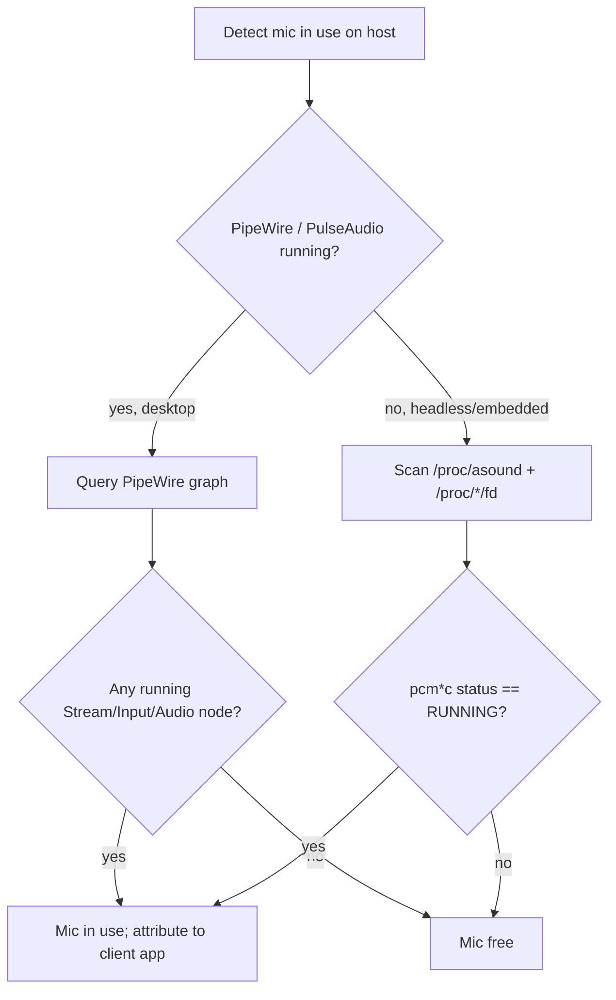
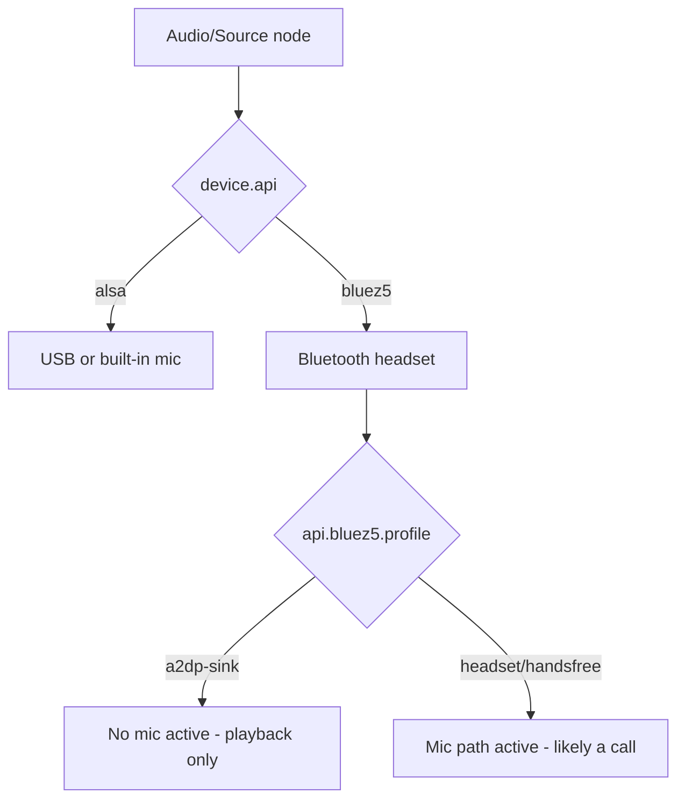
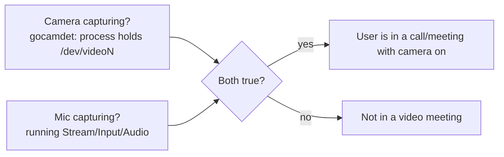

# How to detect microphone use (and "in a meeting") on a Linux host

Date: 2026-07-16

## Goal

Running on the user's desktop host, detect whether the user is **in a call or
meeting with the camera enabled**. That is two facts, ANDed:

1. A camera is actively capturing (already solved by `gocamdet`).
2. A microphone is actively capturing.

This document covers the microphone half and how to combine it with the camera
half. It explicitly covers the case where the audio device is a **Bluetooth
headset**, which behaves very differently from a USB or built-in mic.

Everything here was verified on the target-class host (PipeWire desktop,
Logitech C920 as a USB camera+mic) except where noted as "not live-verified".

## The key decision: query PipeWire, not raw ALSA

`gocamdet` detects a camera by scanning `/proc/*/fd` for open `/dev/videoN`
nodes. The direct analogue for audio is scanning for open
`/dev/snd/pcmC*D*c` (capture) nodes, and reading
`/proc/asound/card*/pcm*c/sub*/status` (which reports `state: RUNNING` and
`owner_pid` without root).

That raw-ALSA approach is correct for a **headless or embedded** host. On a
**desktop host it is the wrong layer**, for two reasons:

1. **The sound server sits in the middle.** This host runs `pipewire`,
   `wireplumber`, and `pipewire-pulse`. Applications do not open `/dev/snd/*`
   directly; PipeWire owns the hardware and apps stream through it. So the
   `owner_pid` you read from ALSA is `pipewire`, not Zoom or Chrome. PipeWire
   also suspends idle devices, so the ALSA node reads `closed` even while
   PipeWire is running and ready.
2. **Bluetooth headsets have no ALSA node at all.** A Bluetooth headset never
   appears under `/dev/snd` or `/proc/asound`. It exists only inside PipeWire
   (via the `bluez5` backend). Raw ALSA is completely blind to it.

Because the goal is per-application, whole-host truth on a desktop — and must
include Bluetooth — **the primary signal is PipeWire**, with raw ALSA as the
headless fallback.



## Microphone detection via PipeWire

PipeWire exposes an object graph. Dump it as JSON with `pw-dump` (present on
this host; `pw-cli`, `wpctl` also available; `pactl` is not installed here).
The objects that matter are `PipeWire:Interface:Node` objects.

### Node classes and states

| `media.class` | What it is | Signal |
| --- | --- | --- |
| `Audio/Source` | A capture device (mic) | Its `state` reflects device activity |
| `Stream/Input/Audio` | An application capturing audio | Its existence + `state=running` = something is recording |
| `Audio/Sink` | An output (speaker) | Ignore for mic detection |

Node `state` values seen live:

- `running` — actively moving audio.
- `idle` — opened/negotiated but not currently streaming.
- `suspended` — not in use (PipeWire has parked it).

### The signal

**A microphone is in use when at least one `Stream/Input/Audio` node is in
`state=running`.** That is the application-facing truth and it is independent of
whether the underlying device is USB, built-in, or Bluetooth.

Verified: while a client recorded from the default source, `pw-dump` showed

```
Audio/Source        state=running    name=alsa_input.usb-046d_HD_Pro_Webcam_C920_...analog-stereo
Stream/Input/Audio  state=running    name=alsa_capture.aplay   app=PipeWire ALSA [aplay]
```

When the client stopped, the `Stream/Input/Audio` node disappeared and the
source dropped to `state=idle`, then `suspended`.

### Attributing to an application

The `Stream/Input/Audio` node's props identify the recorder:

- `application.name` (e.g. the app's display name)
- `application.process.binary` and `application.process.id` (the client PID)
- `node.name`

For a "user is in a meeting" detector, the client PID lets you correlate the
audio recorder with the camera holder (see below).

### Inspecting the graph

```sh
# List audio nodes, their class and state.
# Guard media.class with // "" — many nodes have no media.class and jq's
# test() errors on null.
pw-dump | jq -r '
  .[] | select(.type=="PipeWire:Interface:Node")
      | .info.props as $p
      | select(($p."media.class" // "") | test("Audio"))
      | "\($p."media.class")\t\(.info.state)\t\($p."node.name")\t\($p."application.name" // "")"'

# Is anyone recording right now? Prints true/false; exit 0 = yes, 1 = no.
pw-dump | jq -e '
  [ .[] | select(.type=="PipeWire:Interface:Node")
        | select((.info.props."media.class" // "")=="Stream/Input/Audio")
        | select(.info.state=="running") ] | length > 0'
```

`wpctl status` gives a human-readable tree if you want to eyeball it.

## The Bluetooth headset case

A Bluetooth headset is fundamentally different and is the reason ALSA-only
detection is insufficient.

> Note: the specifics below reflect the BlueZ 5 / PipeWire model. They were not
> live-verified during this investigation because no headset was paired at the
> time (the host's Bluetooth radio `hci0` was active). Confirm field values
> against a real paired headset before relying on them.

### Profiles decide whether there is even a microphone

A Bluetooth headset advertises multiple profiles, and PipeWire exposes one at a
time:

| Profile | `api.bluez5.profile` (approx) | Has mic (capture)? | Quality |
| --- | --- | --- | --- |
| A2DP | `a2dp-sink` | **No** — output only | High-fidelity playback |
| HSP/HFP (headset / hands-free) | `headset-head-unit`, `handsfree` | **Yes** | Low-bandwidth, mono |

Consequence: **when a call starts and an app wants the headset mic, PipeWire
switches the headset from A2DP to HSP/HFP.** That profile switch is itself a
strong "a call is in progress" indicator. A headset sitting in A2DP has no
capture source to detect.

### How a Bluetooth mic appears

- The device shows up as a PipeWire node with `device.api = bluez5` (contrast
  the ALSA mics, which have `device.api = alsa`).
- Only in HSP/HFP does a `bluez5`-backed `Audio/Source` node exist.
- When an app records through it, the same `Stream/Input/Audio` +
  `state=running` signal applies — so **the PipeWire detection logic above works
  unchanged for Bluetooth**. You do not need separate code paths for the
  in-use test; you only need Bluetooth-awareness for classification and for the
  profile heuristic.

### Detecting the Bluetooth angle

1. **In-use:** same as any mic — a running `Stream/Input/Audio` linked to the
   `bluez5` source.
2. **Classification:** on the source/device node, `device.api == "bluez5"` marks
   it as Bluetooth; read `api.bluez5.profile` for A2DP vs HFP.
3. **Deeper (optional):** BlueZ exposes state on D-Bus under
   `org.bluez` (e.g. the `MediaTransport1` object's `State` property goes
   `active` during a call). This is the authoritative Bluetooth-layer signal if
   you want to cross-check PipeWire.



## Putting it together: "in a meeting with camera on"

Combine the two independent signals:



Recommended logic:

1. **Camera:** reuse `gocamdet` — a process holds a `/dev/videoN` node open. For
   a long-running presence detector, `gocamdet --watch` already polls and emits
   on/off transitions (and can run a hook or a systemd service); the mic check
   below can be layered onto the same cadence.
2. **Mic:** at least one `Stream/Input/Audio` node is `running` in PipeWire.
3. **Meeting = camera AND mic.**

### Strengthening with correlation (optional)

Both signals expose a client PID (camera: the `/proc/*/fd` holder; mic: the
stream node's `application.process.id`). If the same process — or two processes
in the same process tree — holds the camera and the audio stream, confidence is
very high. Be aware browsers split media across helper processes, so match on
the process **tree/session**, not an exact PID.

### Edge cases and gotchas

- **Monitoring vs. metering.** Some meeting apps and OS indicators briefly open
  the mic to show a level meter without being in a call. A `running` stream is
  still "mic in use"; a *meeting* is the camera-AND-mic combination, which
  filters most of these out.
- **Push-to-talk / muted-in-app.** App-level mute often keeps the OS stream
  `running` (the app just drops the samples). You will read "in use" even when
  muted. That is usually the desired behavior for a presence detector.
- **Idle vs running.** Treat only `running` as in-use. `idle`/`suspended`
  sources are opened-but-not-capturing and must not count.
- **Bluetooth A2DP-only.** A connected headset in A2DP has no mic; do not infer
  mic use from headset connection alone — require a capture stream.
- **No PipeWire (headless/embedded, e.g. a player).** Fall back to raw ALSA:
  read `/proc/asound/card*/pcm*c/sub*/status` for `state: RUNNING` (root-free)
  and/or scan `/proc/*/fd` for open `/dev/snd/pcmC*D*c`. Bluetooth is not a
  concern on such hosts.

## Implementation notes

- **Querying PipeWire from Go:** simplest is to shell out to `pw-dump` and parse
  its JSON (stable enough for these fields). This adds a runtime dependency on
  `pw-dump` (ships with PipeWire). A pure-Go option is to speak the PipeWire
  protocol over its Unix socket, or use the BlueZ D-Bus API for the Bluetooth
  cross-check; both are heavier.
- **Structure:** mirror `gocamdet` — a `micdet` package with a backend interface
  so the PipeWire backend (desktop) and the ALSA/proc backend (headless) share
  the same public `Detect()` result shape.
- **Permissions:** the PipeWire path needs to run in the user's session
  (access to the PipeWire socket); it does **not** need root. The ALSA fallback
  `status` files are root-free; the `/proc/*/fd` scan needs root only to see
  other users' processes.

## Commands used to verify (reproducible)

```sh
# Audio nodes and states
pw-dump | jq -r '.[]|select(.type=="PipeWire:Interface:Node")|.info.props as $p|select(($p."media.class"//"")|test("Audio"))|"\($p."media.class")\t\(.info.state)\t\($p."node.name")"'

# Raw-ALSA capture status (headless fallback)
cat /proc/asound/card*/pcm*c/sub*/status

# Sound servers present
pgrep -a pipewire; pgrep -a wireplumber

# Bluetooth radio state
bluetoothctl show
```
